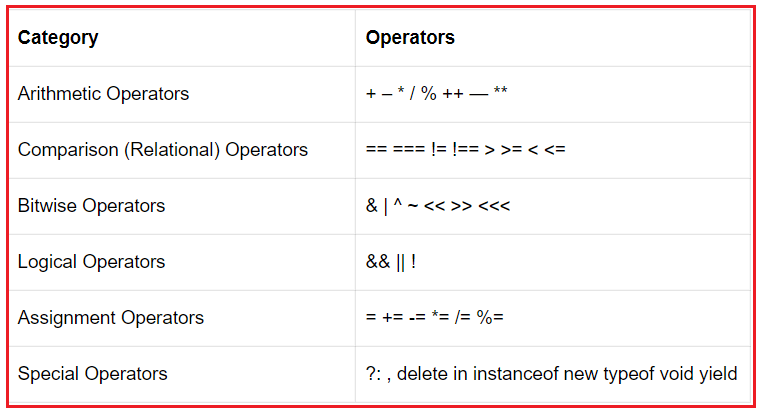

# ABOUT JS 
 #### JS is a popular programming language that has wide range of applications. JavaScript is also used in many other areas.    
 - FRONT-END - React, Angular, Vue.
 - BACK-END - Node js.
 - Mobile applications - React.
 - Desktop applications

# Run JavaScript
 #### Because of its wide range of applications, you can run JavaScript in several ways:
- Using console tab of web browsers.
- Using Node.js
- By creating Web Pages

# VARIABLES
#### Variable is used to hold a data. In JavaScript we have two types (and one more if we sure that we will not change it till the end) of variables. We can use both of them but of course they have some difference.
##### Difference :
1. let : Local
2. Var : Global - it can be local when it is in function.
3. const : doesn't changes

# VALUES
#### We know that their are  8 types of Values.
##### And they are divide into two groups: Primative and Object.
1. Primative (7) : number, string, boolean, null, undefined, symbol, bigInt.
2. Object (3 types) : method of object, function, array;

# Rules for naming JavaScript Variables
#### Variable names should start with a underscore_, or dollar $ or any letter. Variables shouldn't start with numbers !!!.
1. let word = "HELLO"
2. let _word = "HELLO"
3. let $word = "HELLO"

# JavaScript Operators :  
 - Arithmetic :( + , - , * , / )
 - Comparison : ( == , === , >= , <= , != , !== )
 - Logical : ( || , && , ! )
 - Type Conversions : Number( "3, 14" )
 - Assignment : ( = , += , -= , *= , /= , ^= , %= , ) 
